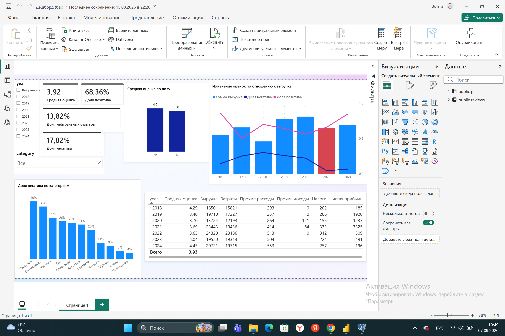

# Кейс: анализ бара «голос гостей × деньги» (2018–2026)

Учебный продуктовый кейс: связать удовлетворённость гостей (отзывы Яндекс.Карт)
с финансовыми результатами бара и дать владельцу рекомендации.

**Инструменты:** Excel (очистка) → PostgreSQL (анализ) → Power BI (дашборд)

## TL;DR — главные выводы

- Средняя оценка 3,92 при пороге «привлекательности» 4,0: репутационный риск.
  Главные боли — **персонал (40% негатива) и время ожидания (36%)**.
- Позитива при этом 68%: продукт гости любят. Проблема не в качестве, а в экономике.
- 2023 — убыточный год (−491 тыс. руб.): выручка −19,6% при «жёстких» расходах (−16,7%).
  Кризис было видно заранее: в 2022 расходы выросли на 19,3% при выручке +3,7%.
- Связи «рейтинг ↔ деньги» нет: в убыточном 2023 рейтинг рос (4,04), а в прибыльном
  2019 был провал рейтинга (3,40). Значит, чинить надо экономику и сервис отдельно.
- Рекомендации: сервис-стандарты и работа с очередями; ежемесячный контроль маржи
  и темпа роста расходов; продвижение сильных сторон (помещение, музыка, атмосфера).

## Данные

| Источник | Описание |
|---|---|
| Яндекс.Карты | ~274 уникальных отзыва, 12 категорий, пол, оценка, дата (28.04.2018–02.08.2026) |
| Отчёт о финансовых результатах | Выручка, расходы, налоги, чистая прибыль, тыс. руб., 2018–2024 |

**Качество данных:** даты приведены к ISO; обнаружены дубликаты текстов — их влияние
проверено сравнением средних до/после дедупликации (distinct on): сдвиг 0,00–0,29 по
годам, годовая динамика и топ категорий не меняются → выводы устойчивы
(скрин сравнения в `results/`).

## Слой 1. Репутация

- Распределение оценок: 5★ — 54,9%, 4★ — 13,5%, 3★ — 13,8%, 2★ — 4,4%, 1★ — 13,5%.
  Доли: позитив 68,4%, нейтрал 13,8%, негатив 17,8%.
- Топ болей (негативные отзывы): персонал — 8, время ожидания — 8, напитки — 6.
- Сильные стороны (позитив): помещение — 42, музыка — 28, «для большой компании» — 15;
  доля негатива по ним 4–9%.
- Пол: женщины 4,03, мужчины 3,82. Мужские боли — алкоголь, атмосфера, персонал, еда;
  женская боль №1 — время ожидания (7 из 21).
- Сезонность: провалы март–апрель и октябрь (рейтинг 3,28–3,34, максимум негатива),
  пики сентябрь (4,69) и декабрь (4,39).

## Слой 2. Экономика

| Год | Выручка | Δ% | Опер. расходы, % выручки | Чистая прибыль |
|---|---|---|---|---|
| 2018 | 16 501 | — | 95,9 | 185 |
| 2019 | 19 710 | +19,5 | 87,4 | 1 920 |
| 2020 | 13 724 | −30,4 | 88,8 | 1 233 |
| 2021 | 23 443 | +70,8 | 82,9 | 3 325 |
| 2022 | 24 320 | +3,7 | 95,3 | 309 |
| 2023 | 19 550 | −19,6 | 98,8 | **−491** |
| 2024 | 20 721 | +6,0 | 95,2 | 196 |

- Маржа структурно тонкая: операционные расходы съедают 83–99% выручки.
- 2022 — ранний сигнал кризиса: расходы +19,3% при выручке +3,7%; прибыль упала с 3 325 до 309.
- 2022 — год «выручка выросла, прибыль нет» (+877 тыс. против −3 016 тыс.).
- Налоги: эффективная нагрузка стабильно ~1–1,2% выручки, включая убыточный 2023
  (≈1% — признак минимального налога). Гипотеза: УСН «доходы минус расходы»;
  ставка 20% к бухгалтерской прибыли не подтверждается.

## Слой 3. Синтез: деньги × голос гостей

| Год | Отзывов | Ср. оценка | Выручка | Чистая прибыль |
|---|---|---|---|---|
| 2018 | 14 | 4,29 | 16 501 | 185 |
| 2019 | 20 | 3,40 | 19 710 | 1 920 |
| 2020 | 10 | 3,70 | 13 724 | 1 233 |
| 2021 | 39 | 3,69 | 23 443 | 3 325 |
| 2022 | 41 | 3,63 | 24 320 | 309 |
| 2023 | 47 | 4,04 | 19 550 | −491 |
| 2024 | 46 | 4,43 | 20 721 | 196 |

- Корреляции нет: убыточный 2023 — лучший по отзывам за кризисный период
  (всего 2 жалобы: еда, напитки), а прибыльный 2019 — худший по рейтингу.
- В лучшем по прибыли 2021 гости хвалили еду, скорость и помещение —
  операционные сильные стороны тогда работали на результат.
- Вывод: репутация и экономика — два независимых контура управления баром.

## Дашборд

Интерактивная версия: срезы по годам и категориям, KPI-карточки, топ болей,
синтез выручки и тональности отзывов (2023 подсвечен как убыточный год).

## Рекомендации владельцу

1. **Сервис:** стандарты работы персонала и регламент скорости отдачи/очередей;
   публичные ответы на все негативные отзывы. Цель: рейтинг ≥ 4,1, негатив ≤ 10%.
2. **Финансы:** ежемесячный контроль маржи и разрыва «темп роста расходов vs темп
   роста выручки» (сигнал 2022 года); ревизия структуры расходов; цель маржи ≥ 8–10%.
3. **Маркетинг:** продвигать помещение, музыку и атмосферу (минимум негатива),
   использовать текущий рейтинг 4,43 как рекламный актив.
4. **Сезонность:** в провальные март–апрель и октябрь — акции и события,
   выравнивающие спрос и нагрузку на персонал.

## Структура репозитория

- `sql/` — запросы по слоям анализа (разведка, отзывы, финансы, синтез)
- `results/` — скриншоты результатов всех ключевых запросов
- `data/` — исходные данные
- `dashboard/` — скриншот дашборда Power BI

## Дисклеймер

Проект учебный, выполнен в портфельных целях. Все данные взяты из открытых
источников: отзывы гостей — публичные отзывы Яндекс.Карт, финансовые
показатели — публичная бухгалтерская отчётность компании (агрегаторы вроде
Rusprofile). Никаких закрытых, персональных или конфиденциальных данных
проект не содержит. Выводы и рекомендации — аналитические суждения автора
на основе открытых данных и не являются официальными заявлениями или
оценками со стороны заведения или его владельцев.

## Ограничения

- Малая выборка отзывов (~274) и один объект — выводы описывают конкретный бар.
- Финансы — публичная отчётность в тыс. руб.; налоговый режим определён как гипотеза.
